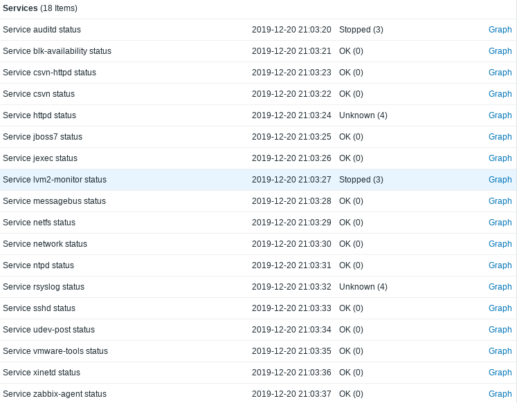

# sysV Services Monitor
Monitoramento de serviços do Linux, indicado para hosts antigos (sysVinit)


## Motivação
O @edsonnsj, lá no [grupo do telegram do Zabbix Brasil](https://t.me/ZabbixBrasil/284147), queria um script para monitorar os serviços dos seus servidores, porém, para os que utilizam ainda o [sysVinit](https://wiki.archlinux.org/index.php/SysVinit), isso é um pouco mais complicado, por conta da falta de padronização das saídas dos status dos serviços.

## Configuração
### No host
Crie o diretório `/scripts` e mova os scripts [service_status.sh](./service_status.sh) e [service_discovery.sh](./service_discovery.sh) para ele. Não esqueça da permissão de execução:

```shell
git clone https://github.com/rauhmaru/sysv_services_monitor.git
mkdir /scripts
cp sysv_services_monitor/service_* /scripts
chmod +x /scripts service_*
```

Em seguida, coloque o arquivo [userparameter_services.conf](./userparmeter_services.conf) no diretório de configurações do Zabbix Agent. Caso tenha instalado via gerenciador de pacote (yum, apt, zypper, etc.), ele estará no diretório `/etc/zabbix/zabbix_agentd.d/`, e em seguida, reinicie o serviço do zabbix_agent:

```shell
cp sysv_services_monitor/userparameter_services.conf /etc/zabbix/zabbix_agentd.d/
service zabbix-agent restart
```

### No Zabbix Server
Importe o [template sysv_service_monitor](./template_sysv_service_monitor.xml) para o seu Zabbix Server e em seguida, adicione no servidor que deseja monitorar os serviços.


### Observações importantes
Alguns serviços podem exibir o status de unknown (4), isso é um bug conhecido pela Red Hat (não verifiquei outras distros). Fazendo testes manuais, elevei os poderes do usuário zabbix, porém sem efeito:

```shell
[root@tmp]# su -l zabbix service rsyslog status; status $?
rsyslogd status unknown due to insufficient privileges.
4
[root@tmp]# su -l zabbix service httpd status; echo $?
httpd status unknown due to insufficient privileges.
4
```
Outros serviços podem gerar uma saída parecida. Para esses casos, se o serviço for importante, recomendo utilizar outros métodos de monitoramento, como por exemplo, verificar se o processo está em execução, se a porta está aberta...

## Rerefências
* [Linux Standard Base Core Specification, Generic Part, Chapter 22. System Initialization](https://refspecs.linuxbase.org/LSB_5.0.0/LSB-Core-generic/LSB-Core-generic/iniscrptact.html)
* [Bug 684881 - In RHEL5, non-privileged users can receive incorrect service status information](https://bugzilla.redhat.com/show_bug.cgi?id=684881)
* [RHBA-2011:1040 - Bug Fix Advisory - SysVinit bug fix update](https://access.redhat.com/errata/RHBA-2011:104)
